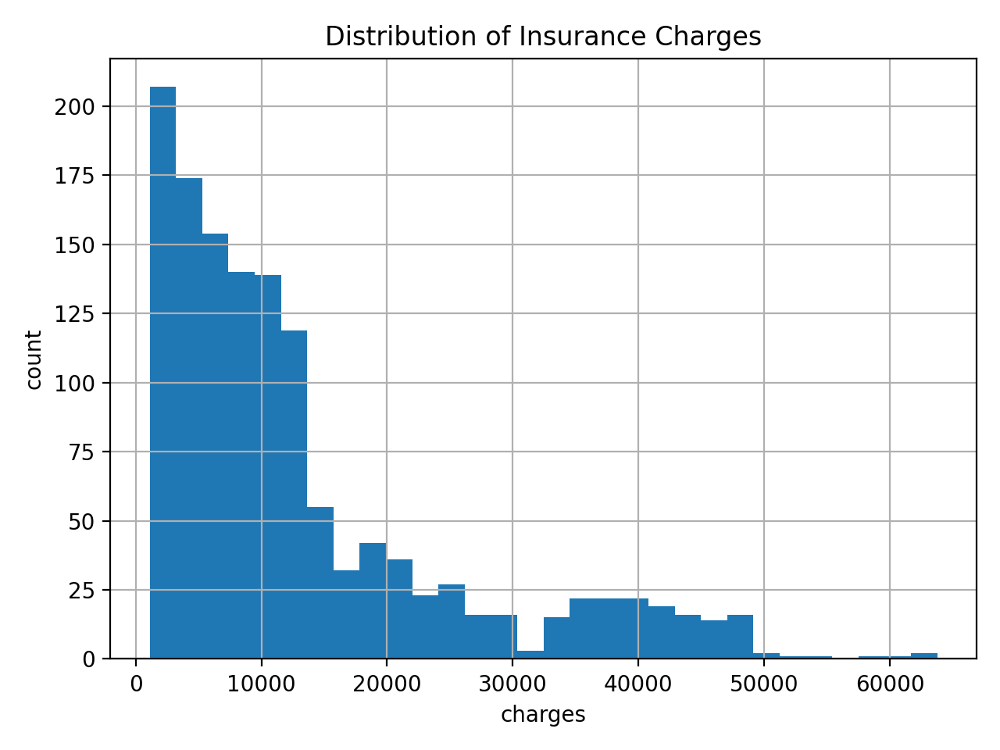
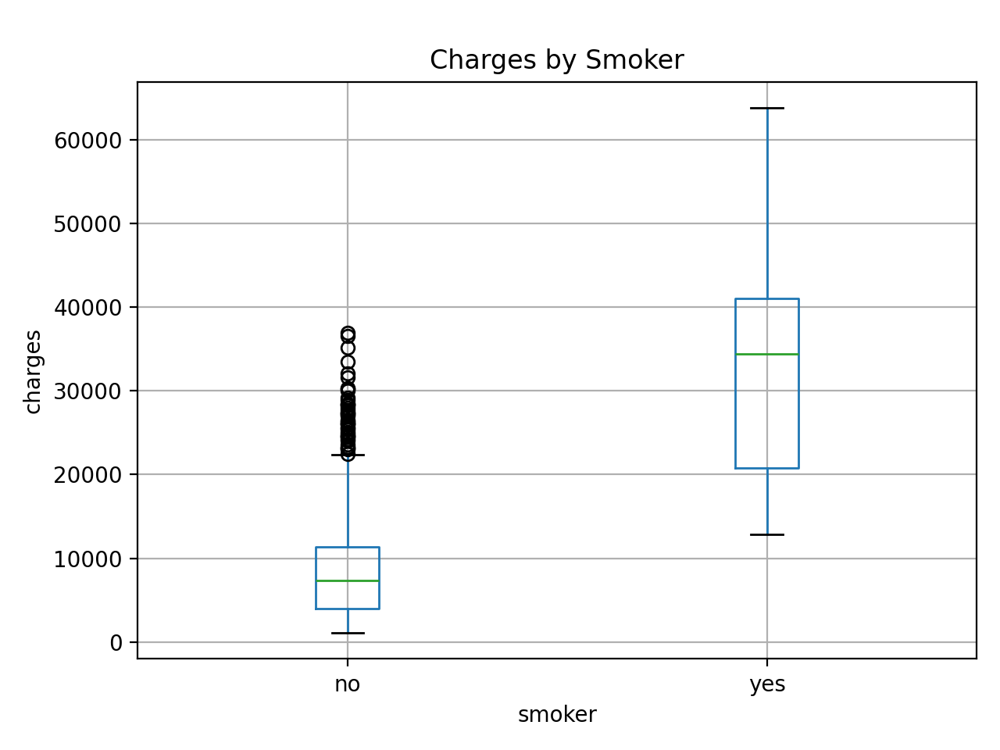
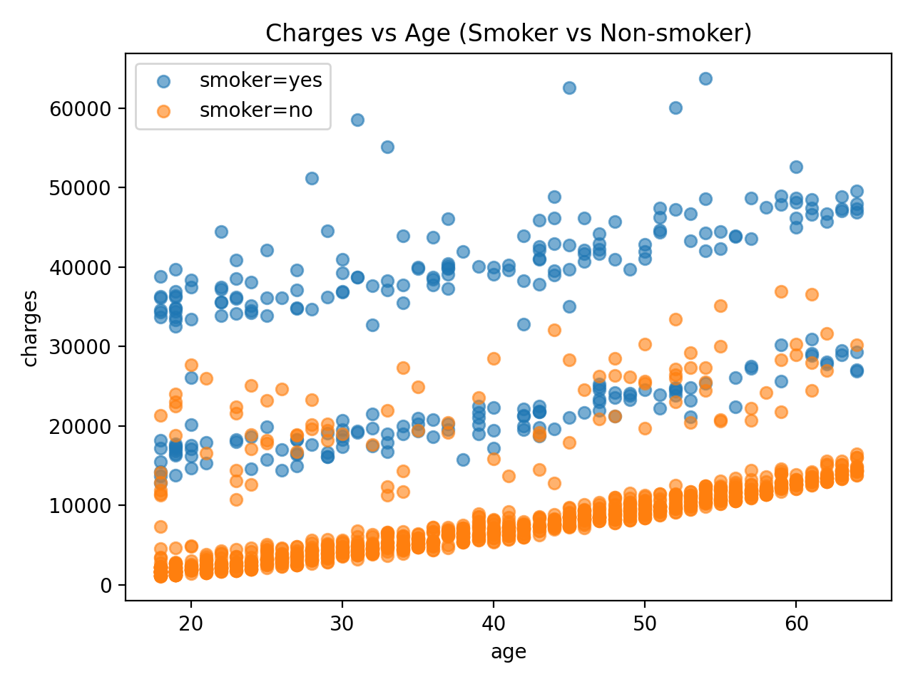

# Insurance Cost Prediction (EDA + ML)

End-to-end Python project to analyze and predict **medical insurance charges** using policyholder attributes (age, BMI, smoker status, region, etc.).  
Built as a portfolio-ready project with clean data workflow, reproducible ML pipeline, evaluation, and model persistence.

## Problem
Predict `charges` (medical insurance cost) based on:
- age, sex, bmi, children, smoker, region

## Dataset
- `data/raw/insurance.csv`
- 1338 rows (after cleaning: 1337) and 7 columns
- Processed dataset:
- `data/processed/insurance_clean.csv (used for modeling)`

## Data Cleaning
- Removed 1 duplicate row
- No missing values found

## EDA Highlights
- Charges are **right-skewed**
- **Smoker status** is the strongest driver of charges
- Charges generally increase with **age** and **BMI**, especially for smokers

```md
### EDA Figures



```
## Modeling Results
### Baseline: Linear Regression
- MAE: ~4,177
- RMSE: ~5,956
- R²: ~0.807

### Improved: Random Forest Regressor
- MAE: ~2,645
- RMSE: ~4,700
- R²: ~0.880

## Feature Importance (Random Forest)
Top drivers:
1. smoker_yes
2. bmi
3. age
4. children
5. sex_male

## Project Structure

```text
insurance-cost-prediction/
├─ data/
│  ├─ raw/
│  └─ processed/
├─ notebooks/
├─ src/
├─ reports/
│  └─ figures/
├─ models/
├─ .gitignore
├─ README.md
└─ requirements.txt 
```
## Notebook:
notebooks/02_final_report.ipynb

## Saved model:
models/insurance_cost_model_rf.joblib

## How to Run
Run from project root: 

E:\Shubhangi\Python\insurance-cost-prediction
pip install -r requirements.txt
python src/make_figures.py
python src/train.py
python src/predict.py

## Author
Shubhangi Pawar
